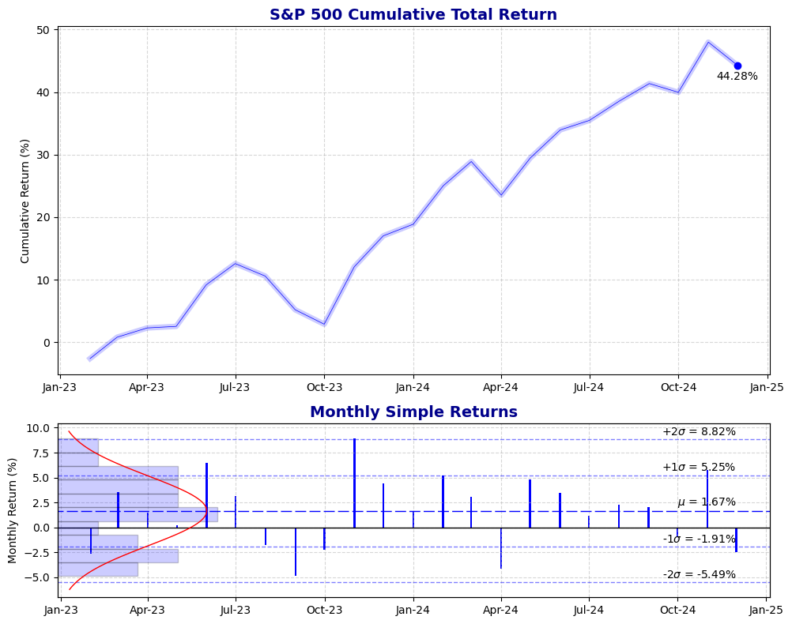

Despite the heat, you're in full battle dress, weighed down with an additional 50lbs of tactical equipment and ammunition.  Your sweat-soaked clothes cling to your body like a toddler testing your patience.  And then there are the mosquitoes.  You are a mosquito magnet - the tastiest one in a long time - and word has reached the biting gnats, too.  

Despite all that, you're running late.  Adjacent units are counting on you to clear an objective where the enemy is dug in and expecting you.  As it happens, the terrain seems to be on their side.  After encountering a river that was not on the map and a bog endowed with mines, you need to make up time.

The sounds of distant gunfire and artillery momentarily take you back to the first lesson you learned in Basic: **No excuse!**  You're jolted from your mini daydream as the commander's barking over the radio for your *sitrep*.  By his tone, you know that he knows you're late, too.  You have a time and place to be in 30 minutes, and at this rate, you will be late.

Fortunately, you also have a platoon of the finest cavalry troopers you will ever know who share your sense of urgency.  Adding to your fortune, you are all well versed in the basic language of tactical maneuver.  You are free to improvise and problem solve on the spot because you've drilled the basics of *shoot, move and communicate* since day 1.    


Concepts like *traveling overwatch* and *alternating bounds* are the articles and prepositions of your platoon's maneuver lingua.  It's the stuff that's spoken subconsciously, freeing up cycles to handle novel circumstances.  All of the classroom instruction and field training have led to this moment.  It's a moment where the bullets are real, the mosquitoes are hungry, and you're late....

Alright, enough with the hook!  It's time to get to the main subject of this post before I completely lose myself in a fictional fever dream of an assault.  The title of this post is meant to be a metaphore for being proficient in the basics.  I view *shoot, move, and communicate* as a professional mindset.  In any profession it is important to master the tactics of the trade; to be able to execute, maneuver, and convey complex concepts to a wide audience.  These are the key ingredients to accomplishing the mission, regardless of your job.  A professional is a subject matter expert in their domain, and a successful professional is one who is able to *shoot, move, and communicate* their way through any challenge with which they are confronted.  

Implicit in this mindset is a view that the table stakes for success, among other things, is competency in the fundamentals.  A platoon that is unversed in the basics will fail to be effective on the battlefield.  Similarly, a quantitative analyst must be fluent in the most basic financial concepts, know how to wrangle data, and be a versatile communicator to be able to produce interesting and actionable analyses.  

Thus, it is in the spirit of *shoot, move, and communicate* that we'll start with basics: financial returns.  And it doesn't get more basic than that, so let's jump in it....  We'll start with the concept of simple returns, and then show how they can be linked together to yield a compounded time-weighted return. 

**Our task:** Calculate the total return of the S&P 500 Index for the two years ended Dec'24 and produce a graphic to visualize it.

**Conditions:** With two years of monthly price history for the index, we'll leverage **python** and a few useful libraries to do the heavy lifting.

**Standard:** Armed only with the resources mentioned above, we'll perform our own custom computations and visual output.

A full example of this exercise is available on my [notebooks git repository](https://github.com/rtrimble13/tb-notebooks/blob/main/src/twr.ipynb)

Let's start with a plot of the monthly closing prices for the index to gain some intuition about its price evolution:


As we can see, it's been a good couple of years for the index.  Starting at close to the 4,000 level, it has gained ~2,000 points over the two-year period, with the strongest increase ocurring in 2024.  Even if you don't follow the markets, it has been hard to avoid the talking heads remarking on the disonance between Wall Street and Main Street.

### Simple Returns 

The simple return is perhaps the most atomic building block in quantitative analysis.  It represents a percent change in the value of an asset, measured as the change in value of the asset over a time period divided by the starting value in that period.  Mathematically, it is: 

$$
R_t = \frac{V_t - V_0}{V_0} \tag{1}
$$
Where $V_0$ is the starting value and $V_t$ is the ending value after $t$ amount of time.  For example, if you have a thing that is worth $10 at the beginning of the day and is worth $11 at the end of the day, then your return on the day is $10\% = \frac{\$11-\$10}{\$10}$.

If you received additional cash flows, or dividends, during the return period, then the expression becomes:

$$
R_t = \frac{V_t + D - V_0}{V_0} \tag{2}
$$
Where $D$ are the additional cash flows that occured during $t$.  For example, if your thing had a starting value $V_0$ and then paid a dividend $D$ during the day, the dividend event will have reduced the value of your thing.  Since, you still received the dividend, you need to add that cash flow back into the return calculation for it to be accurate.  We'll talk more about dividends at a later time $t$...

The simple return is the most appropriate measure of returns over short time periods and when compounding is immaterial to the asset's return.  When compounding is material, e.g., when the price is affected by incoming and outgoing cash flows, then simple returns are likely to reflect an inacurate measure of performance.  Absent compounding effects, however, simple returns work as advertised.  They can give you a quick intuition about growth potential of a security, index, or anything else that has a measurable value.  They are also useful for comparing similar assets, such as the performance of two stocks over the course of a year.  Note, if either of those stocks pays dividends, or is impacted by corporate actions, such as a stock split, then those events need to be accounted for.  Also for another another time.

In short, presenting performance in terms of simple returns is best for situations where compounding is not a factor in the asset's value.

Given our time series of S&P 500 monthly close prices, stored in a **pandas** DataFrame, here are a couple of ways to compute monthly simple returns:

```python
sp_returns = sp_prices['Close'].pct_change()  # method 1 

sp_returns = sp_prices['Close'].rolling(window=2).apply(
    lambda x: x[1]/x[0] - 1, raw=True
)  # method 2 
```
Clearly, the first method is better for this exercise, since it uses a built-in function to compute the return.  The second method is more "dyi," and has a time and place better suited for more complex operations.

### Geometric (Time-Weighted) Returns 
As mentioned above, the simple return puches above its weight in many scenarios.  There are times, though, when it is not the best measure of return.  Consider an investment portfolio, for instance.  Over time, there are likely to be cash flows into and out of the portfolio.  Those flows will affect the overall value of the portfolio, since cash is either being invested in return-generating securities, or securities are being sold for cash to be withdrawn from the portfolio.  Either of these scenarios produce compounding effects that invalidate the simple return.  

To isolate the impact of investment performance from the effects of cash flows, we introduce the time-weighted return, or TWR.  Mathematically, TWR is a geometric linking of subperiod simple returns, or:

$$
R_{TWR} = \prod_{i=1}^{N}{(1 + R_i)} - 1 \tag{3}
$$
Where $N$ is the number of subperiods, e.g., 24 months in a 2-year period, and $R_i$ are the subperiod (monthly) returns.  Under this approach, our return calculation will still be impacted by intra-month cash activity, but the impact is isolated to the return of the month the activity occured.  Increasing the frequency of subperiods, e.g., from monthly to weekly or daily, improves the accuracy of the performance return.  Fortunately, in our case with S&P data, we're unaffected by compounding effects, so this exercise is largely for show!  Sometimes, though, we might only have returns data provided to us.  Computing the TWR is then often the best way to go. 

So, how do we compute a TWR with **pandas**?  There are many ways to skin this cat, and here's one of them:

```python
(
    sp_data                      # our dataframe.
    .returns                     # the monthly returns series (pre-computed)
    .dropna()                    # since the first price month has no return, we need to drop it.
    .add(1).cumprod().sub(1)     # TWR calculation see (3).
    .mul(100)                    # convert to percentage.  
    .iloc[-1]                    # the last series value is our TWR.
)
```
And that's it..  Too easy, right?

Usually, it's easier to work with annualized returns for the sake of comparing investments.  An annualized return is just a TWR expressed as an annual growth rate, and is computed as:

$$
R_{Annual} = (1 + R_{TWR})^{\frac{t}{n}} - 1  \tag{4}
$$
Where $R_{TWR}$ is the total return, $t$ is the number of subperiods in a year, e.g., 12 for monthly data, and $n$ is the number of subperiods used to compute the total return.  Since our TWR is based on 2 years of monthly returns, $n=24$.  

Putting it all together, starting with closing prices, we can compute the annualized return for the S&P 500 ended Dec'24 as:

```python
(
    sp_data                             # closing prices 
    .pct_change()                       # compute the subperiod returns.
    .dropna()                           # first month has no return.
    .add(1).cumprod()                   # compute TWR. 
    .pow(12. / len(sp_data)).sub(1)     # annualize the TWR.
    .mul(100)                           # convert to percentage. 
    .iloc[-1].values[0]                 # take the last value. 
)
```

### Visualizing the Data 
We all know a good picture is worth more than a sentence or two..  Thus, putting some effort into a good visual is well worth the time.  Luckily, with just a handful of code, **matplotlib** makes this almost as easy as it sounds.  Contrast the bare-bones chart of closing prices above with this one depicting the index performance:



While this chart won't win any awards, I feel it is visually more appealing than the one above.  The full code to produce it is available in the companion notebook, so it won't add value to spill it here.  Some highlights to call out, though:
1. Labeling data points is an art more than science.  I've added one for the total return (44.28%).  I could have added more at some key points in the series.
2. The return series by itself hides a lot of information.  Adding a bar plot of the monthly returns helps provide intuition about the trending strength or weakness of the index over time.
3. Adding a histogram of the monthly returns further emphasizes the distribution characteristics.
4. Comparing the emperical distribution to a normal distribution via the red curve reminds us that financial returns are rarely normally distributed.
5. Finally, calling out the +/- one and two standard deviation levels can help us understand the significance of a given monthly return.  This information is perhaps most useful for appreciating the downside potential, or risk, of an investment.


Action front!  Let's move out and draw fire!!

**Note:** This post is not investment advice.  It is meant to be educational and entertaining.  If you find it useful, please let me know.  If you think it sucks, please also let me know - though I prefer constructive advice : >

**Sources:**

*Army Field Manual FM 3-21.18*

[TurningBull companion Jupyter Notebook Git repository](https://github.com/rtrimble13/tb-notebooks.git)

[Python homepage](https://www.python.org)

[Pandas documentation page](https://pandas.pydata.org/docs/)

[Matplotlib documentation page](https://matplotlib.org/)